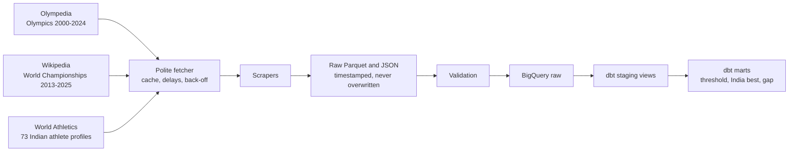
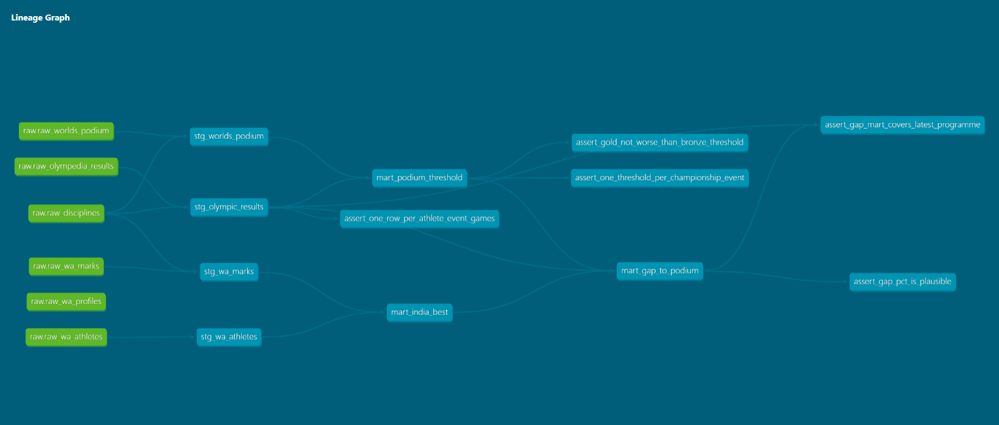

# Gap to the Podium: India vs the World

How far are India's best athletes from an Olympic medal in each athletics event, and which young athletes are on track to win one?

This project collects 25 years of Olympic and World Championship results plus the current marks of 73 Indian athletes, models them in a cloud warehouse, and measures the gap to the podium in every event. Later phases add a trajectory model for juniors, an API, a dashboard, a GenAI assistant and a funding case.

> Status (October 2026): Phases 0 to 2 complete. Phase 3 (statistics) is next. See the [roadmap](#roadmap).

## First results

India's best current mark (outdoor, legal, 2025 to 2026 seasons) against the Olympic bronze threshold (average of the third-best podium mark at the last three Games), with World Athletics' own world-list rank for that mark. A negative gap means India is already ahead of the threshold.

| Event | Athlete | Best mark | Gap to bronze | World rank |
| --- | --- | --- | --- | --- |
| Men's javelin | Neeraj Chopra | 90.23 m | -4.37% | 3 |
| Men's long jump | Sreeshankar | 8.38 m | -1.21% | 9 |
| Men's 10,000 m * | Gulveer Singh | 27:00.22 | -0.67% | 12 |
| Men's 5000 m * | Gulveer Singh | 13:03.93 | -0.29% | 38 |
| Men's triple jump | Praveen Chithravel | 17.37 m | +1.10% | 10 |
| Women's steeplechase * | Parul Chaudhary | 9:08.67 | +1.10% | 11 |
| Men's high jump | Sarvesh Kushare | 2.31 m | +1.56% | 6 |
| Women's long jump | Ancy Sojan | 6.88 m | +1.76% | 12 |

\* Tactical events: Olympic finals in middle-distance, long-distance and road events are often slow and tactical, so their bronze marks understate medal pace. For these, read the gap together with the world rank: a 5000 m gap of -0.29% still means 38 athletes ran faster that season.

**What it shows so far:** in field events, where finals are all-out efforts, the gap and the world rank agree (javelin, long jump, high jump, triple jump). In sprints and distance events, a small time gap can hide dozens of faster athletes, which is why both measures are kept side by side. Coverage: 41 of the 42 individual events on the Paris 2024 programme have a current Indian mark.

These numbers are a snapshot: 2026 world ranks can change as the season goes on.

## How it works



- **Collection (Python):** three scrapers share one fetcher that caches every page, waits between requests to each site, backs off when a site refuses (HTTP 429 or 202), and only ever caches real pages.
- **Validation:** one command checks all sources together: medallists have marks, gold beats bronze, no mark is better than the world record, no duplicate athletes, every athlete is Indian. It stops the pipeline if anything fails.
- **Warehouse (BigQuery + dbt):** raw tables load into BigQuery; dbt builds four staging views and three marts, with 34 data tests and a lineage graph.



## Data sources

| Source | Used for | Notes |
| --- | --- | --- |
| [Olympedia](https://www.olympedia.org) | Olympic results 2000-2024, every athlete in every individual event | Unofficial volunteer site; scraped slowly and cached |
| [Wikipedia](https://en.wikipedia.org/wiki/2023_World_Athletics_Championships) | World Championship podiums 2013-2025 | Secondary source; a fixed random sample of 10 marks matched official results ([check](docs/worlds_crosscheck.csv)). Text is CC BY-SA 4.0 |
| [World Athletics](https://worldathletics.org) | Indian athletes' personal bests, season bests, season-by-season progression, birth dates, world-list positions | Data embedded in each profile page; every athlete ID was copied from a real profile and checked against name and country |

## Run it yourself

Requirements: Python 3.11, Git, GNU Make, and the Google Cloud CLI with a free BigQuery sandbox project.

```bash
# 1. Set up
py -3.11 -m venv .venv            # macOS/Linux: python3.11 -m venv .venv
.\.venv\Scripts\Activate.ps1       # macOS/Linux: source .venv/bin/activate
make setup
cp .env.example .env               # then set CONTACT_EMAIL (sent in the scrapers' User-Agent)

# 2. Check everything offline
make check                         # ruff + 239 tests, no internet needed

# 3. Collect and validate the data (Phase 1)
make phase1                        # scrapers, then validation; cached pages make reruns fast

# 4. Load and transform in BigQuery (Phase 2)
gcloud auth application-default login
make load                          # validates first, then loads 6 raw tables
make dbt-build                     # builds and tests every dbt model
```

Run `make help` for every command.

## Data quality and testing

- **239 offline Python tests**, built on trimmed copies of real pages, so every tricky case found in the wild stays fixed: a DNF finalist, an annulled gold, a shared bronze with two different marks, an indoor mark filed as outdoor.
- **34 dbt data tests** on the warehouse, including one that checks the gap mart has exactly one row for every event at the latest Games.
- **Cross-source validation** before every load.
- **One parser of record:** marks are converted to numbers once, by a tested Python function, and loaded beside the original text.

A few things the checks caught along the way:

- Olympedia's women's 100 m hurdles tables had no marks at all in any Games; marks are now read from each round's own table.
- Wikipedia keeps annulled results in pink rows and writes some road times as `1:26.34` for 1 hour 26 minutes 34 seconds.
- 19 of 22 World Athletics IDs generated by an AI assistant loaded athletes from other countries; the name and country checks caught all of them, and every ID was looked up again by hand.

## Project structure

```
src/            fetcher, mark parser, event maps, scrapers, validation, BigQuery loader
dbt/            dbt project: staging views, marts, tests, BigQuery profile
tests/          offline Python tests and real-page fixtures
scripts/        exploration helpers used to inspect each source before writing parsers
data/seeds/     hand-verified list of Indian athletes and their World Athletics IDs
docs/           cross-check sheet and images
```

## Roadmap

| Phase | What | Status |
| --- | --- | --- |
| 0 | Setup: repository, environment, Google Cloud | Done |
| 1 | Data acquisition: Olympedia, World Championships, World Athletics, validation | Done |
| 2 | Warehouse and transformation: BigQuery, dbt, gap-to-podium marts | Done |
| 3 | Statistics: confidence intervals, hypothesis tests, fair comparisons for tactical events | Next |
| 4 | Trajectory model for juniors (mixed-effects, MLflow, backtest) | Planned |
| 5 | Production: FastAPI, Docker, Prefect, PySpark, Cloud Run | Planned |
| 6 | Power BI dashboard | Planned |
| 7 | GenAI assistant: RAG, LangGraph agent, LoRA fine-tuning | Planned |
| 8 | Business case: funding model and stakeholder deck | Planned |

## License

Code: MIT (see [LICENSE](LICENSE)). Data belongs to its sources: Olympedia, Wikipedia (CC BY-SA 4.0) and World Athletics. Raw data is not stored in this repository; the scrapers rebuild it.
